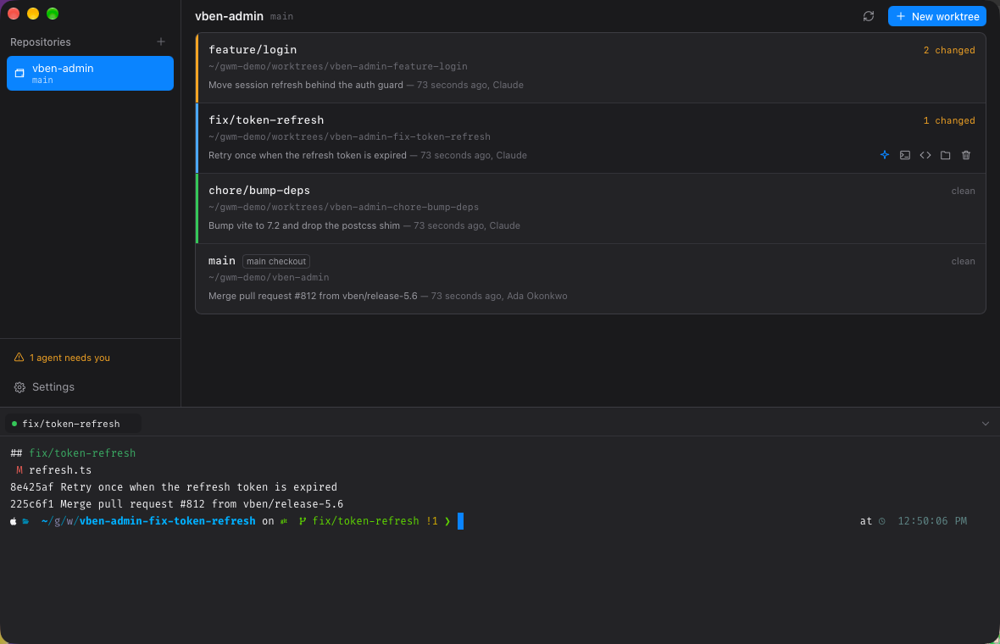

# Worktree Station

[](https://github.com/mk7luke/worktree-station/actions/workflows/ci.yml)
[](https://github.com/mk7luke/worktree-station/releases/latest)

Run several coding agents on one repository at the same time, each in its own checkout, and see
at a glance which one needs you.



## Why

Point two agents at the same working directory and they fight: one rewrites a file the other is
still reading, builds race for the same lock, and `git` trips over its own index.

`git worktree` already solves this — it gives a branch its own directory backed by the same
repository. The friction is everything around it: remembering the `git worktree add` incantation,
reinstalling `node_modules` in every new checkout, and having no idea which of your six terminals
is the one waiting on a permission prompt.

This app is the control surface for that workflow.

## What it does

**Worktrees, as a list you can scan.** Every worktree shows its branch, where it lives, what is
uncommitted, how far it has drifted from its upstream, and its last commit. A three-pixel rule
down the left edge is the only colour on screen — amber when an agent is waiting on you, blue
while it works, green when it is idle — so the one that needs attention is obvious from across
the room. Worktrees sort themselves by that state.

**Create without the ceremony.** Name a branch, pick a starting point, and the directory is
derived for you. New branch or an existing local or remote one; the picker hides branches already
checked out somewhere else, because git will refuse those anyway.

**Share what git ignores.** A fresh worktree normally means another `npm install`. Turn on
sharing and the app symlinks the ignored paths you choose — `node_modules`, `.env`, `target` —
from the main checkout, so the new worktree is usable immediately and costs no extra disk.

The candidates come from `git ls-files --others --ignored --exclude-standard --directory`, so the
whole gitignore grammar is honoured by git itself. The linked paths are then recorded in the
repository's local exclude file: a pattern like `node_modules/` matches directories only, and git
sees a symlink as a file, so without that step every shared folder would reappear as untracked and
be one `git add -A` away from getting committed.

**A real terminal, in the window.** Each worktree opens a login shell in its own directory —
your `$SHELL`, your prompt, your PATH — as tabs in a dock you can resize. Because the app owns
the PTY, it knows first-hand when a session is alive, rather than hunting for it by process id.
Pick a Nerd Font in Settings and Powerlevel10k or Starship renders the way it does everywhere else.

**Delete with the blast radius spelled out.** Removing a worktree tells you how many uncommitted
changes and unpushed commits you are about to lose. Deleting the local branch and deleting it on
the remote are separate, separately-labelled choices, because only one of them affects your
colleagues.

**Claude Code status (optional).** Turn it on in Settings and the app installs a hook that reports
when Claude starts working, finishes, or asks for approval, and raises a system notification for
that last one. It merges into `~/.claude/settings.json` alongside hooks you already have, and
turning it off removes only the entries it added.

## Keyboard

| | |
|---|---|
| <kbd>↑</kbd> <kbd>↓</kbd> | Move between worktrees |
| <kbd>⌘</kbd><kbd>N</kbd> | New worktree |
| <kbd>⌘</kbd><kbd>T</kbd> | Open a shell in the selected worktree |
| <kbd>⌘</kbd><kbd>↩</kbd> | Run Claude in the selected worktree |
| <kbd>⌘</kbd><kbd>⌫</kbd> | Remove the selected worktree |
| <kbd>⌘</kbd><kbd>R</kbd> | Refresh |
| <kbd>⌘</kbd><kbd>`</kbd> | Show or hide the terminal |
| <kbd>⌘</kbd><kbd>,</kbd> | Settings |

## Platforms

macOS, Windows and Linux. There is no platform-specific behaviour in the interface; the parts
that genuinely differ — how a folder is revealed, which terminal opens, how a directory is
linked — each have one implementation per platform behind a shared API.

Linking uses symlinks on macOS and Linux. On Windows directories become junctions, which need no
privileges; if one does, every such link is collected into a single elevation prompt rather than
one per folder.

## Build

Requires [Rust](https://rustup.rs) and Node 20+. On Linux, also install the
[Tauri system dependencies](https://tauri.app/start/prerequisites/).

```bash
npm install
npm run app          # run in development
npm run app:build    # produce a release bundle
```

```bash
npm run typecheck && (cd src-tauri && cargo test)
```

## How it is put together

The Rust side is small and split by concern: `git` shells out to `git` and parses porcelain
output, `worktree` orchestrates creation and deletion, `linker` shares ignored paths, `pty` owns
terminal sessions, `fonts` reads family names out of installed font files, `claude` runs the hook
listener, and `system` handles the Finder/terminal/editor handoff. The parsers are covered by
unit tests, and every function that deletes something verifies first that the target really is a
worktree of the repository it was given.

The frontend is Vue 3 and Tailwind. Colour is reserved for state, so the interface stays neutral
until something is actually happening.

## Licence

MIT
